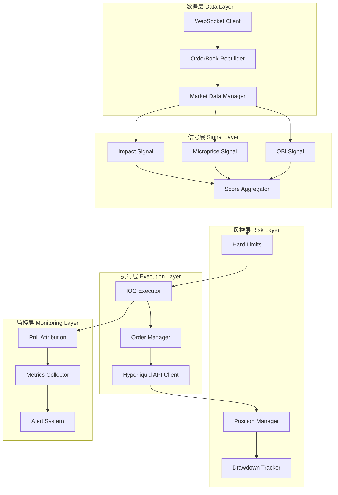
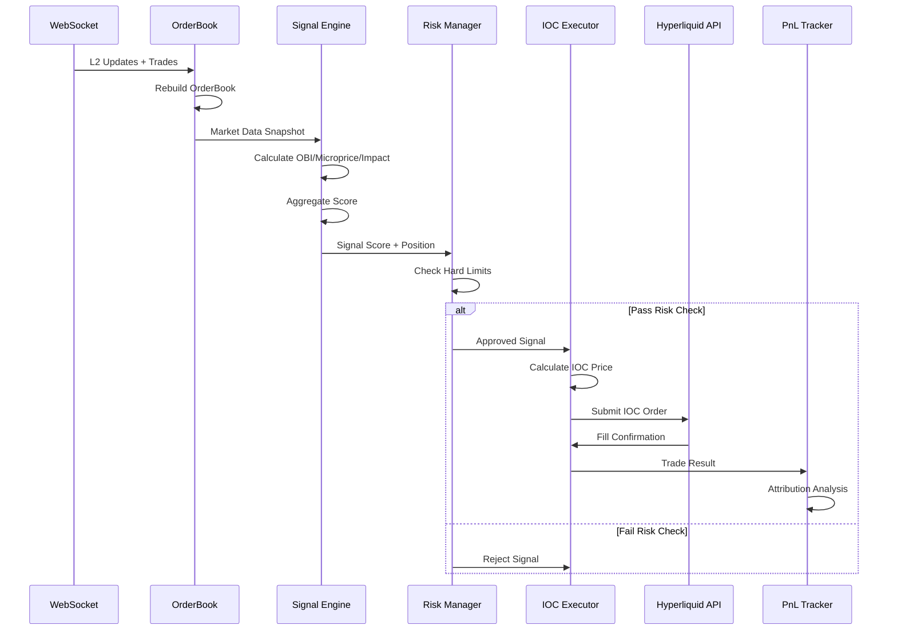
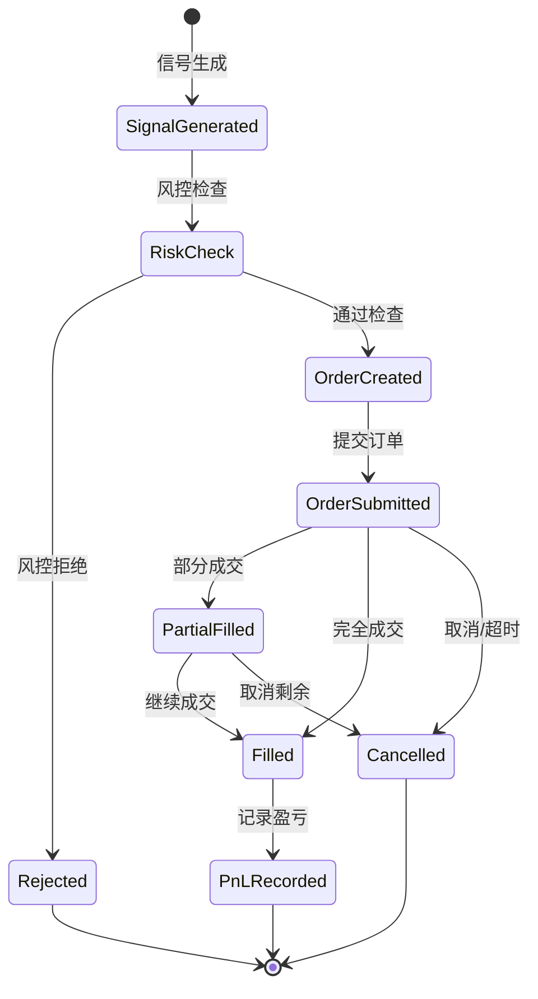
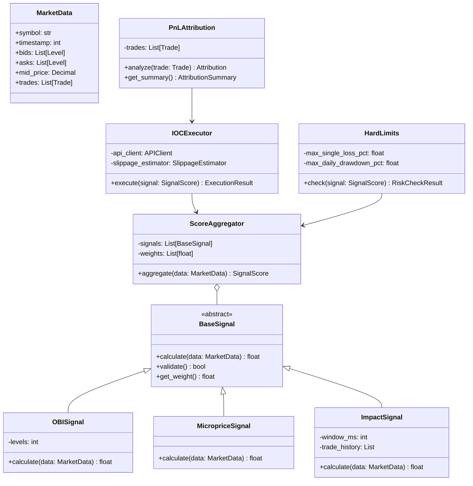
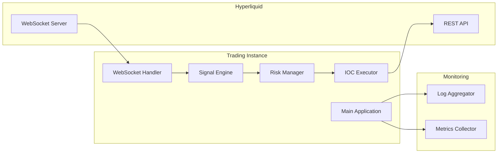

# Hyperliquid 高频交易系统架构设计

> **设计原则**：Week 1 IOC-only 基线优先，聚焦于"信号强度 × 成交确定性"

---

## 一、系统整体架构

### 1.1 分层架构图



### 1.2 系统特点

* **数据驱动**：WebSocket 实时数据流驱动整个系统
* **信号聚合**：多个信号源统一聚合，提供综合评分
* **执行确定**：IOC 优先，确保成交确定性
* **风控前置**：风控检查在执行前进行，避免违规交易
* **实时监控**：全链路性能监控和 PnL 归因

---

## 二、数据流图

### 2.1 Week 1 核心数据流



### 2.2 订单生命周期



---

## 三、Week 1 核心模块设计

### 3.1 数据接入模块

#### 3.1.1 WebSocket Client

**职责**：
* 建立和维护与 Hyperliquid WebSocket 的连接
* 处理 L2 订单簿更新和成交数据
* 自动重连和异常处理

**核心接口**：
```python
class WebSocketClient:
    async def connect(self) -> None
    async def subscribe(self, symbols: List[str]) -> None
    async def on_message(self, callback: Callable) -> None
    async def disconnect(self) -> None
```

**性能指标**：
* 连接延迟 < 100ms
* 消息处理延迟 < 5ms
* 自动重连时间 < 1s

#### 3.1.2 OrderBook Rebuilder

**职责**：
* 从增量更新重建完整订单簿
* 维护多档位的买卖盘
* 提供订单簿快照查询

**核心接口**：
```python
class OrderBook:
    def update(self, l2_data: L2Update) -> None
    def get_snapshot(self) -> OrderBookSnapshot
    def get_best_bid_ask(self) -> Tuple[Price, Price]
    def get_depth(self, levels: int = 5) -> Dict[str, List[Level]]
```

**数据结构**：
```python
@dataclass
class Level:
    price: Decimal
    size: Decimal

@dataclass
class OrderBookSnapshot:
    symbol: str
    timestamp: int
    bids: List[Level]
    asks: List[Level]
    mid_price: Decimal
```

### 3.2 信号引擎模块

#### 3.2.1 信号基类

**设计理念**：
* 统一的信号接口，便于扩展
* 每个信号独立计算和验证
* 支持信号组合和权重调整

**核心接口**：
```python
class BaseSignal(ABC):
    @abstractmethod
    def calculate(self, market_data: MarketData) -> float

    @abstractmethod
    def validate(self) -> bool

    def get_weight(self) -> float
```

#### 3.2.2 OBI（Order Book Imbalance）信号

**计算公式**：
```
OBI = (BidVolume - AskVolume) / (BidVolume + AskVolume)
```

**实现**：
```python
class OBISignal(BaseSignal):
    def __init__(self, levels: int = 5):
        self.levels = levels

    def calculate(self, market_data: MarketData) -> float:
        bid_volume = sum(level.size for level in market_data.bids[:self.levels])
        ask_volume = sum(level.size for level in market_data.asks[:self.levels])
        return (bid_volume - ask_volume) / (bid_volume + ask_volume)
```

**预期 IC**：≥ 0.03（Spearman 相关性）

#### 3.2.3 Microprice 信号

**计算公式**：
```
Microprice = (BestAsk × BidSize + BestBid × AskSize) / (BidSize + AskSize)
```

**实现**：
```python
class MicropriceSignal(BaseSignal):
    def calculate(self, market_data: MarketData) -> float:
        best_bid = market_data.bids[0]
        best_ask = market_data.asks[0]

        microprice = (
            best_ask.price * best_bid.size +
            best_bid.price * best_ask.size
        ) / (best_bid.size + best_ask.size)

        mid_price = (best_bid.price + best_ask.price) / 2
        return float((microprice - mid_price) / mid_price * 10000)  # bps
```

#### 3.2.4 Impact 信号

**职责**：
* 检测大单冲击
* 识别价格异常波动
* 评估市场深度变化

**实现**：
```python
class ImpactSignal(BaseSignal):
    def __init__(self, window_ms: int = 100):
        self.window_ms = window_ms
        self.trade_history = []

    def calculate(self, market_data: MarketData) -> float:
        # 计算最近窗口内的净买卖压力
        recent_trades = self._get_recent_trades(self.window_ms)
        buy_volume = sum(t.size for t in recent_trades if t.side == 'buy')
        sell_volume = sum(t.size for t in recent_trades if t.side == 'sell')
        return (buy_volume - sell_volume) / (buy_volume + sell_volume)
```

#### 3.2.5 Score Aggregator

**职责**：
* 聚合多个信号
* 计算综合评分
* 提供置信度分级

**实现**：
```python
class ScoreAggregator:
    def __init__(self, signals: List[BaseSignal], weights: List[float]):
        self.signals = signals
        self.weights = weights

    def aggregate(self, market_data: MarketData) -> SignalScore:
        scores = [sig.calculate(market_data) for sig in self.signals]
        weighted_score = sum(s * w for s, w in zip(scores, self.weights))

        return SignalScore(
            value=weighted_score,
            confidence=self._calculate_confidence(scores),
            individual_scores=scores
        )

    def _calculate_confidence(self, scores: List[float]) -> ConfidenceLevel:
        abs_score = abs(sum(scores))
        if abs_score > self.theta_1:
            return ConfidenceLevel.HIGH
        elif abs_score > self.theta_2:
            return ConfidenceLevel.MEDIUM
        else:
            return ConfidenceLevel.LOW
```

### 3.3 IOC 执行器模块

#### 3.3.1 执行策略

**核心逻辑**：
```mermaid
flowchart TD
    A[Signal Score] --> B{|Score| > θ₁?}
    B -->|Yes| C[High Confidence]
    B -->|No| D{|Score| > θ₂?}
    D -->|Yes| E[Medium Confidence]
    D -->|No| F[Low Confidence]
    C --> G[IOC/Aggressive Limit]
    E --> H[Skip - Week 2]
    F --> I[Skip Trade]
    G --> J[Submit Order]
    J --> K[Wait Fill]
    K --> L[Record PnL]
```

#### 3.3.2 IOC Executor 实现

**核心接口**：
```python
class IOCExecutor:
    def __init__(
        self,
        api_client: HyperliquidAPIClient,
        slippage_estimator: SlippageEstimator
    ):
        self.api_client = api_client
        self.slippage_estimator = slippage_estimator

    async def execute(
        self,
        signal: SignalScore,
        position: Position
    ) -> Optional[ExecutionResult]:
        # 1. 检查置信度
        if signal.confidence == ConfidenceLevel.LOW:
            return None

        # 2. 计算订单参数
        side = 'buy' if signal.value > 0 else 'sell'
        size = self._calculate_size(signal, position)
        price = self._calculate_ioc_price(signal, side)

        # 3. 提交订单
        order = await self.api_client.place_order(
            symbol=position.symbol,
            side=side,
            size=size,
            price=price,
            order_type='ioc'  # Immediate-Or-Cancel
        )

        # 4. 等待成交确认
        fill = await self._wait_for_fill(order.id, timeout=1.0)

        # 5. 返回执行结果
        return ExecutionResult(
            order_id=order.id,
            fill_price=fill.price,
            fill_size=fill.size,
            expected_price=price,
            slippage=abs(fill.price - price),
            timestamp=fill.timestamp
        )

    def _calculate_ioc_price(self, signal: SignalScore, side: str) -> Decimal:
        """计算贴盘口限价"""
        market = self.api_client.get_market_data()

        if side == 'buy':
            # 买入：贴 best ask
            return market.best_ask
        else:
            # 卖出：贴 best bid
            return market.best_bid
```

#### 3.3.3 Slippage Estimator

**职责**：
* 估计预期滑点
* 基于历史成交数据建模
* 为风控提供成本预测

**实现**：
```python
class SlippageEstimator:
    def __init__(self, history_window: int = 1000):
        self.history_window = history_window
        self.slippage_history = []

    def estimate(
        self,
        symbol: str,
        side: str,
        size: Decimal
    ) -> Decimal:
        """估计滑点（bps）"""
        recent = self._get_recent_slippage(symbol, side)

        # 基于尺寸调整
        size_factor = self._size_adjustment(size)
        base_slippage = np.median(recent)

        return base_slippage * size_factor

    def record(self, execution: ExecutionResult) -> None:
        """记录实际滑点"""
        slippage_bps = (
            abs(execution.fill_price - execution.expected_price) /
            execution.expected_price * 10000
        )
        self.slippage_history.append(slippage_bps)
```

### 3.4 风控模块

#### 3.4.1 Hard Limits（硬熔断）

**三大熔断条件**：
1. 单笔亏损 > 0.8% 净值
2. 日回撤 > 5%
3. API 异常/预言机异常

**实现**：
```python
class HardLimits:
    def __init__(
        self,
        max_single_loss_pct: float = 0.008,  # 0.8%
        max_daily_drawdown_pct: float = 0.05,  # 5%
        nav: Decimal = Decimal('100000')
    ):
        self.max_single_loss_pct = max_single_loss_pct
        self.max_daily_drawdown_pct = max_daily_drawdown_pct
        self.nav = nav
        self.daily_pnl = Decimal('0')
        self.api_healthy = True

    def check(
        self,
        signal: SignalScore,
        position: Position
    ) -> RiskCheckResult:
        # 1. 检查 API 健康度
        if not self.api_healthy:
            return RiskCheckResult(
                approved=False,
                reason="API unhealthy"
            )

        # 2. 检查单笔风险
        estimated_loss = self._estimate_max_loss(signal, position)
        if estimated_loss > self.nav * Decimal(str(self.max_single_loss_pct)):
            return RiskCheckResult(
                approved=False,
                reason=f"Single trade risk too high: {estimated_loss}"
            )

        # 3. 检查日回撤
        if self.daily_pnl < -self.nav * Decimal(str(self.max_daily_drawdown_pct)):
            return RiskCheckResult(
                approved=False,
                reason=f"Daily drawdown exceeded: {self.daily_pnl}"
            )

        return RiskCheckResult(approved=True)
```

#### 3.4.2 Position Manager

**职责**：
* 跟踪当前持仓
* 计算仓位限制
* 管理库存风险

**实现**：
```python
class PositionManager:
    def __init__(self, max_position_size: Decimal):
        self.max_position_size = max_position_size
        self.positions: Dict[str, Position] = {}

    def can_trade(
        self,
        symbol: str,
        side: str,
        size: Decimal
    ) -> bool:
        current_pos = self.positions.get(symbol, Position(symbol, Decimal('0')))

        # 计算新仓位
        new_size = current_pos.size
        if side == 'buy':
            new_size += size
        else:
            new_size -= size

        # 检查是否超限
        return abs(new_size) <= self.max_position_size

    def update(self, symbol: str, side: str, size: Decimal) -> None:
        if symbol not in self.positions:
            self.positions[symbol] = Position(symbol, Decimal('0'))

        if side == 'buy':
            self.positions[symbol].size += size
        else:
            self.positions[symbol].size -= size
```

### 3.5 PnL 归因模块

#### 3.5.1 归因分解

**核心公式**：
```
Total PnL = Alpha + Rebate - Fee - Slippage - Impact
```

**实现**：
```python
class PnLAttribution:
    def __init__(self):
        self.trades: List[Trade] = []

    def analyze(self, trade: Trade) -> Attribution:
        # 1. 计算方向性收益（Alpha）
        mid_change = trade.exit_mid - trade.entry_mid
        alpha = mid_change * trade.size if trade.side == 'buy' else -mid_change * trade.size

        # 2. 计算手续费
        fee = trade.size * trade.entry_price * Decimal('0.0005')  # 5 bps

        # 3. 计算滑点
        entry_slippage = abs(trade.entry_price - trade.entry_mid)
        exit_slippage = abs(trade.exit_price - trade.exit_mid)
        total_slippage = (entry_slippage + exit_slippage) * trade.size

        # 4. 计算冲击（暂时简化）
        impact = Decimal('0')  # Week 1 简化

        # 5. Rebate（Week 1 为 0，因为全是 IOC）
        rebate = Decimal('0')

        return Attribution(
            alpha=alpha,
            fee=fee,
            slippage=total_slippage,
            impact=impact,
            rebate=rebate,
            total_pnl=alpha + rebate - fee - total_slippage - impact
        )

    def get_summary(self) -> AttributionSummary:
        """生成汇总报告"""
        total_alpha = sum(attr.alpha for attr in self.attributions)
        total_fee = sum(attr.fee for attr in self.attributions)
        total_slippage = sum(attr.slippage for attr in self.attributions)
        total_pnl = sum(attr.total_pnl for attr in self.attributions)

        return AttributionSummary(
            alpha=total_alpha,
            fee=total_fee,
            slippage=total_slippage,
            total_pnl=total_pnl,
            alpha_percentage=float(total_alpha / total_pnl) if total_pnl != 0 else 0,
            cost_percentage=float((total_fee + total_slippage) / total_pnl) if total_pnl != 0 else 0
        )
```

---

## 四、类图与接口设计

### 4.1 核心类关系图



### 4.2 数据模型

```python
from dataclasses import dataclass
from decimal import Decimal
from enum import Enum

class ConfidenceLevel(Enum):
    LOW = "low"
    MEDIUM = "medium"
    HIGH = "high"

@dataclass
class SignalScore:
    value: float
    confidence: ConfidenceLevel
    individual_scores: List[float]
    timestamp: int

@dataclass
class ExecutionResult:
    order_id: str
    fill_price: Decimal
    fill_size: Decimal
    expected_price: Decimal
    slippage: Decimal
    timestamp: int

@dataclass
class Attribution:
    alpha: Decimal
    fee: Decimal
    slippage: Decimal
    impact: Decimal
    rebate: Decimal
    total_pnl: Decimal

@dataclass
class RiskCheckResult:
    approved: bool
    reason: Optional[str] = None
```

---

## 五、性能要求与指标

### 5.1 延迟要求（Week 1 目标）

| 组件 | 目标延迟 | 监控方法 |
|------|----------|----------|
| WebSocket 消息处理 | < 5ms | p99 延迟监控 |
| 订单簿更新 | < 5ms | 时间戳差值 |
| 信号计算 | < 10ms | 函数执行时间 |
| 风控检查 | < 2ms | 函数执行时间 |
| 订单提交 | < 50ms（含网络） | API 响应时间 |
| **端到端延迟** | **< 100ms** | **全链路追踪** |

### 5.2 信号质量指标

| 信号 | IC 目标 | 分层收益（Top-Bottom） | 稳健性要求 |
|------|---------|----------------------|------------|
| OBI | ≥ 0.03 | > 成交成本（~8 bps） | 跨时段/品种 |
| Microprice | ≥ 0.03 | > 成交成本 | 跨时段/品种 |
| Impact | ≥ 0.02 | > 成交成本 | 跨时段/品种 |

### 5.3 PnL 结构指标（健康标准）

| 指标 | 目标值 | 说明 |
|------|--------|------|
| Alpha 占比 | ≥ 70% | 方向性收益主导 |
| Fee + Slip | ≤ 25% | 成交成本控制 |
| Rebate | ≤ 10% | Week 1 为 0（全 IOC） |
| 胜率 | ≥ 60% | 扣除成本后 |
| 盈亏比 | ≥ 1.5 | 平均盈利/平均亏损 |

### 5.4 系统稳定性指标

| 指标 | 目标值 | 监控方法 |
|------|--------|----------|
| API 成功率 | ≥ 99.5% | 错误日志统计 |
| WebSocket 连接稳定性 | 99.9% | 断连次数/时长 |
| 订单成交率（IOC） | ≥ 95% | 成交确认统计 |
| 系统可用性 | 99.5% | 运行时间监控 |

---

## 六、Week 1 验证标准

### 6.1 必须达到的指标

#### 1. 信号验证
- [ ] 至少 1 个信号 IC ≥ 0.03（Spearman）
- [ ] 信号分层收益（Top vs Bottom）> 8 bps
- [ ] 跨时段稳健性：高波动/低波动都有效
- [ ] 跨品种稳健性：BTC/ETH 都适用

#### 2. IOC-only 盈利性
- [ ] 去除 maker 后 E[trade] > 0
- [ ] 胜率 ≥ 60%（扣除成交成本）
- [ ] 盈亏比 ≥ 1.5

#### 3. PnL 结构健康
- [ ] Alpha 占比 ≥ 70%
- [ ] Fee + Slip ≤ 25%
- [ ] 成交成本与预估偏差 < 20%

#### 4. 系统稳定性
- [ ] 24h 运行无宕机
- [ ] API 成功率 ≥ 99.5%
- [ ] 端到端延迟 p99 < 150ms

### 6.2 输出文档

Week 1 结束时必须产出：

1. **信号验证报告**
   - IC 值、p-value、稳健性测试
   - 分层收益图表
   - 延迟敏感性分析

2. **IOC-only 基线性能报告**
   - 胜率、盈亏比、夏普比率
   - 成交成本分布（Fee/Slip/Impact）
   - 不同置信度下的表现

3. **PnL 归因报告**
   - Alpha vs Cost 分解图
   - 每日 PnL 曲线
   - 风控触发统计

---

## 七、技术栈与工具选择

### 7.1 核心技术

| 层级 | 技术选择 | 理由 |
|------|----------|------|
| 语言 | Python 3.11 | 高性能 + asyncio 支持 |
| 包管理 | UV | 快速依赖解析 |
| 数据处理 | pandas + polars | 高频数据处理优化 |
| 异步框架 | asyncio | 原生异步 I/O |
| 配置管理 | pydantic + YAML | 类型安全配置 |
| 测试框架 | pytest + pytest-asyncio | 异步测试支持 |
| 监控 | structlog + prometheus | 结构化日志 + 指标 |

### 7.2 依赖库

```toml
[project.dependencies]
python = "^3.11"
websockets = "^12.0"
httpx = "^0.26.0"
pandas = "^2.1.0"
polars = "^0.20.0"
pydantic = "^2.5.0"
pyyaml = "^6.0.1"
structlog = "^24.1.0"
prometheus-client = "^0.19.0"

[project.optional-dependencies]
dev = [
    "pytest>=7.4.0",
    "pytest-asyncio>=0.21.0",
    "pytest-cov>=4.1.0",
    "black>=23.12.0",
    "ruff>=0.1.9",
    "mypy>=1.7.0",
]
```

---

## 八、部署架构（Week 1 简化版）



**部署说明**：
* Week 1 单实例部署，聚焦功能验证
* Week 2 考虑多实例 + 负载均衡
* 所有配置通过环境变量 + YAML 管理
* 日志输出到 stdout，便于容器化部署

---

## 九、开发路线图

### Week 1 里程碑

**Day 1-2**：数据层
- [ ] WebSocket 连接与订单簿重建
- [ ] L2 + Trades 数据录制

**Day 3-4**：信号层
- [ ] OBI/Microprice/Impact 信号实现
- [ ] 信号前瞻性验证脚本

**Day 5-6**：执行层 + 风控层
- [ ] IOC 执行器实现
- [ ] 硬熔断风控
- [ ] 滑点估计器

**Day 7**：监控层 + 集成测试
- [ ] PnL 归因系统
- [ ] 端到端测试
- [ ] 生成验证报告

### Week 2 增强计划

- [ ] Tradeability 因子
- [ ] 浅被动执行增强
- [ ] 动态风控模式切换
- [ ] 规模化测试（1× → 3×）

---

## 十、风险与缓解

| 风险 | 概率 | 影响 | 缓解措施 |
|------|------|------|----------|
| 信号 IC 不达标 | 中 | 高 | 增加信号源，优化参数 |
| API 延迟过高 | 低 | 高 | 切换 RPC 节点，优化网络 |
| 滑点超预期 | 中 | 中 | 减小订单尺寸，避开低流动性时段 |
| 硬熔断误触发 | 低 | 中 | 调整阈值，增加人工审核 |
| 系统宕机 | 低 | 高 | 自动重启，健康检查 |

---

**文档版本**：v1.0
**最后更新**：2025-10-25
**负责人**：架构团队
**审核状态**：待审核
